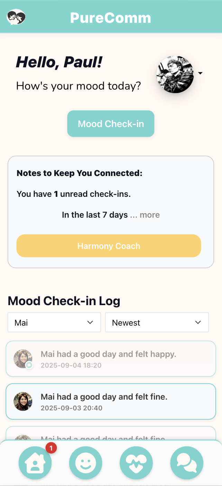
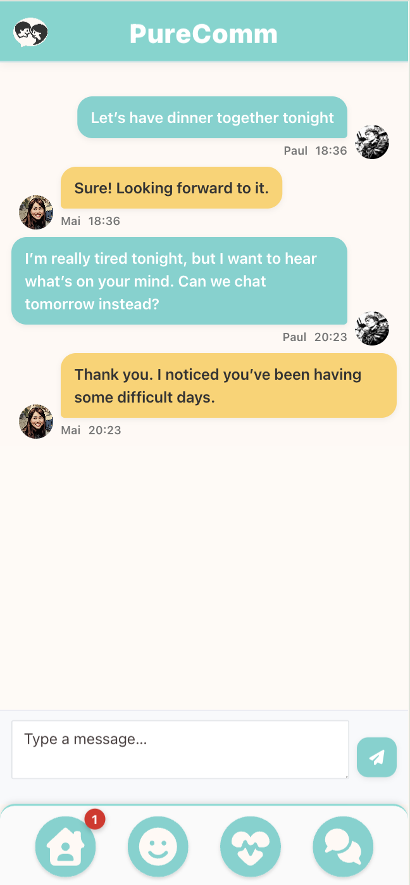

# 📚 PureComm

PureComm is a relationship wellness platform designed to help couples improve communication and emotional awareness.
It lets users share daily mood check-ins, raise grievances, and track patterns over time with helpful visualizations and reminders.
The app encourages open dialogue and supports healthier, more connected relationships.

<h2>Quick Look</h2>
<p align="center">
  
  
  
</p>

<details>
  <summary><strong>Show 4 more</strong></summary>
  <p align="center">
    
    
    
    
  </p>
</details>
<br>
App home: https://WHATEVER.herokuapp.com

## Getting Started

### Setup

Install gems

```
bundle install
```

### ENV Variables

Create `.env` file

```
touch .env
```

Inside `.env`, set these variables. For any APIs, see group Slack channel.

```
CLOUDINARY_URL=your_own_cloudinary_url_key
```

### DB Setup

```
rails db:create
rails db:migrate
rails db:seed
```

### Run a server

```
rails s
```

## Built With

- [Rails 7](https://guides.rubyonrails.org/) - Backend / Front-end
- [Stimulus JS](https://stimulus.hotwired.dev/) - Front-end JS
- [Heroku](https://heroku.com/) - Deployment
- [PostgreSQL](https://www.postgresql.org/) - Database
- [Bootstrap](https://getbootstrap.com/) — Styling
- [Figma](https://www.figma.com) — Prototyping

## Acknowledgements

Inspired by Jane Mount's [Bibliophile](https://www.amazon.com/Bibliophile-Illustrated-Miscellany-Jane-Mount/dp/1452167230) and a story my father once told me: "Why do we keep books? ... We keep books because they remind us of the new perspectives and lessons we learned".

## Team Members

- [Douglas Berkley](https://www.linkedin.com/in/dougberkley/)

## Contributing

Pull requests are welcome. For major changes, please open an issue first to discuss what you would like to change.

## License

This project is licensed under the MIT License
